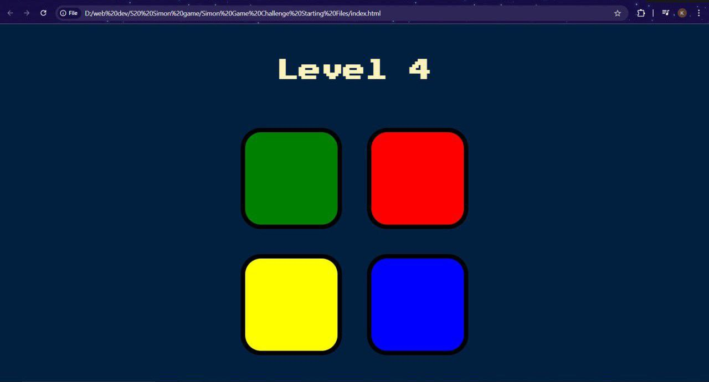
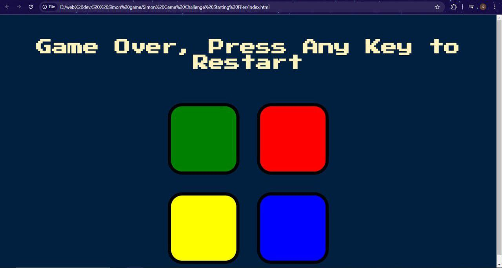

Simon Game is a browser-based memory game built using HTML, CSS, JavaScript, and jQuery. The game tests your memory by challenging you to replicate a randomly generated pattern of colors and sounds.

## Features
- **Dynamic Gameplay**: The game generates a new sequence in every level, which the user must replicate.
- **Sound Effects**: Each button produces a unique sound for an interactive experience.
- **Visual Feedback**: Buttons flash and animations indicate user interaction.
- **Game Over**: Visual and textual feedback is displayed when the user makes an incorrect sequence.

## Technologies Used
1. **HTML**: To structure the web page.
2. **CSS**: For styling and animations.
3. **JavaScript**: For game logic.
4. **jQuery**: For DOM manipulation and event handling.

## How to Play
1. Open the game in your browser.
2. Press any key to start the game.
3. Memorize the sequence of flashing colors.
4. Click the buttons in the same sequence.
5. The game continues to the next level with an extended sequence if the user matches the pattern.
6. If the user clicks the wrong button, the game ends, and a "Game Over" message is displayed. You can restart the game by pressing any key.

## Project Structure
├── index.html # HTML file for the game ├── styles.css # CSS file for styling ├── game.js # JavaScript file for game logic ├── sounds/ # Folder containing sound files for buttons │ ├── blue.mp3 │ ├── green.mp3 │ ├── red.mp3 │ ├── yellow.mp3 │ └── wrong.mp3


## Installation
1. Clone the repository:
```bash
git clone https://github.com/mech-kal/simon-game.git
```
2. Navigate to the project directory:
```bash
cd simon-game
```
3. Open index.html in your browser.

## Dependencies
jQuery (included via CDN in the HTML file).

## Screenshots
1. Start

2. Gameover
